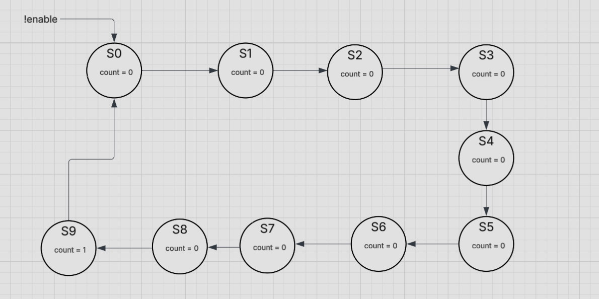

# Traffic Light Simulator

This is a design of an actuated traffic light controller at a four-way intersection. A Traffic Light Controller are finite state machines at their simplest form, so we can represent its behavior with states and various transitions. 

### State Diagrams

Above is the state diagram for a modulo-10 counter, which is responsible for driving  time_upA and time_upB. Like most counters, this FSM is a moore machine and has no inputs but an enable bit. 

Above is the state diagram for the light controller itself. S0 is where Light A is green and Light B is red. S1 is where Light A is yellow and Light B is red. S3 is where Light A is red and Light B is green. S4 is where Light A is red and Light B is yellow.

### State Encoding Table and State Transition Table

*2-bit Binary Encoding for Traffic Lights*
| Light  | Binary |
|--------|--------|
| GREEN  | 10  |
| YELLOW | 01  |
| RED    | 00  |

*State Encoding Table*
| State | One-Hot Code |
|----------|----------|
| S0    | 0001     |
| S1    | 0010     |
| S2    | 0100     |
| S3    | 1000     |

I chose to use one-hot encoding due to the fact that it would require less external gates (combinational logic), reducing propogation delay as a whole. Although it would require two more flip-flops than binary encoding, the reduction of next-state logic complexity makes it worth it. 

| A | B | C | D | Ta | Tb | time_upA | time_upB | A' | B' | C' | D' | Y1 | Y2 | Y3 | Y4 |
|---|---|---|---|---|---|---|---|---|---|---|---|---|---|---|---|
| 0 | 0 | 0 | 1 | 0 | X | 0 | X | 0 | 0 | 1 | 0 | 0 | 0 | 0 | 0 |
| 0 | 0 | 0 | 1 | 0 | X | 1 | X | 0 | 0 | 1 | 0 | 0 | 0 | 0 | 0 |
| 0 | 0 | 0 | 1 | 1 | X | 0 | X | 0 | 0 | 0 | 1 | 0 | 0 | 0 | 0 |
| 0 | 0 | 0 | 1 | 1 | X | 1 | X | 0 | 0 | 1 | 0 | 0 | 0 | 0 | 0 |
| 0 | 0 | 1 | 0 | X | X | X | X | 0 | 1 | 0 | 0 | 0 | 0 | 0 | 0 |
| 0 | 1 | 0 | 0 | X | 0 | X | 0 | 1 | 0 | 0 | 0 | 0 | 0 | 0 | 0 |
| 0 | 1 | 0 | 0 | X | 0 | X | 1 | 1 | 0 | 0 | 0 | 0 | 0 | 0 | 0 |
| 0 | 1 | 0 | 0 | X | 1 | X | 0 | 0 | 1 | 0 | 0 | 0 | 0 | 0 | 0 |
| 0 | 1 | 0 | 0 | X | 1 | X | 1 | 1 | 0 | 0 | 0 | 0 | 0 | 0 | 0 |
| 1 | 0 | 0 | 0 | X | X | X | X | 0 | 0 | 0 | 1 | 0 | 0 | 0 | 0 |

<table>
  <tr>
    <th colspan="4">Present State</th>
    <th colspan="4">Inputs</th>
    <th colspan="4">Next State</th>
    <th colspan="4">Outputs</th>
  </tr>

  <tr>
    <th>A</th><th>B</th><th>C</th><th>D</th>
    <th>Ta</th><th>Tb</th><th>time_upA</th><th>time_upB</th>
    <th>A'</th><th>B'</th><th>C'</th><th>D'</th>
    <th>Y1</th><th>Y2</th><th>Y3</th><th>Y4</th>
  </tr>

  <tr>
    <td>0</td><td>0</td><td>0</td><td>1</td>
    <td>0</td><td>X</td><td>0</td><td>X</td>
    <td>0</td><td>0</td><td>1</td><td>0</td>
    <td>0</td><td>0</td><td>0</td><td>0</td>
  </tr>

  <tr>
    <td>0</td><td>0</td><td>0</td><td>1</td>
    <td>0</td><td>X</td><td>1</td><td>X</td>
    <td>0</td><td>0</td><td>1</td><td>0</td>
    <td>0</td><td>0</td><td>0</td><td>0</td>
  </tr>

  <tr>
    <td>0</td><td>0</td><td>0</td><td>1</td>
    <td>1</td><td>X</td><td>0</td><td>X</td>
    <td>0</td><td>0</td><td>0</td><td>1</td>
    <td>0</td><td>0</td><td>0</td><td>0</td>
  </tr>

  <tr>
    <td>0</td><td>0</td><td>0</td><td>1</td>
    <td>1</td><td>X</td><td>1</td><td>X</td>
    <td>0</td><td>0</td><td>1</td><td>0</td>
    <td>0</td><td>0</td><td>0</td><td>0</td>
  </tr>

  <tr>
    <td>0</td><td>0</td><td>1</td><td>0</td>
    <td>X</td><td>X</td><td>X</td><td>X</td>
    <td>0</td><td>1</td><td>0</td><td>0</td>
    <td>0</td><td>0</td><td>0</td><td>0</td>
  </tr>

  <tr>
    <td>0</td><td>1</td><td>0</td><td>0</td>
    <td>X</td><td>0</td><td>X</td><td>0</td>
    <td>1</td><td>0</td><td>0</td><td>0</td>
    <td>0</td><td>0</td><td>0</td><td>0</td>
  </tr>

  <tr>
    <td>0</td><td>1</td><td>0</td><td>0</td>
    <td>X</td><td>0</td><td>X</td><td>1</td>
    <td>1</td><td>0</td><td>0</td><td>0</td>
    <td>0</td><td>0</td><td>0</td><td>0</td>
  </tr>

  <tr>
    <td>0</td><td>1</td><td>0</td><td>0</td>
    <td>X</td><td>1</td><td>X</td><td>0</td>
    <td>0</td><td>1</td><td>0</td><td>0</td>
    <td>0</td><td>0</td><td>0</td><td>0</td>
  </tr>

  <tr>
    <td>0</td><td>1</td><td>0</td><td>0</td>
    <td>X</td><td>1</td><td>X</td><td>1</td>
    <td>1</td><td>0</td><td>0</td><td>0</td>
    <td>0</td><td>0</td><td>0</td><td>0</td>
  </tr>

  <tr>
    <td>1</td><td>0</td><td>0</td><td>0</td>
    <td>X</td><td>X</td><td>X</td><td>X</td>
    <td>0</td><td>0</td><td>0</td><td>1</td>
    <td>0</td><td>0</td><td>0</td><td>0</td>
  </tr>
</table>

